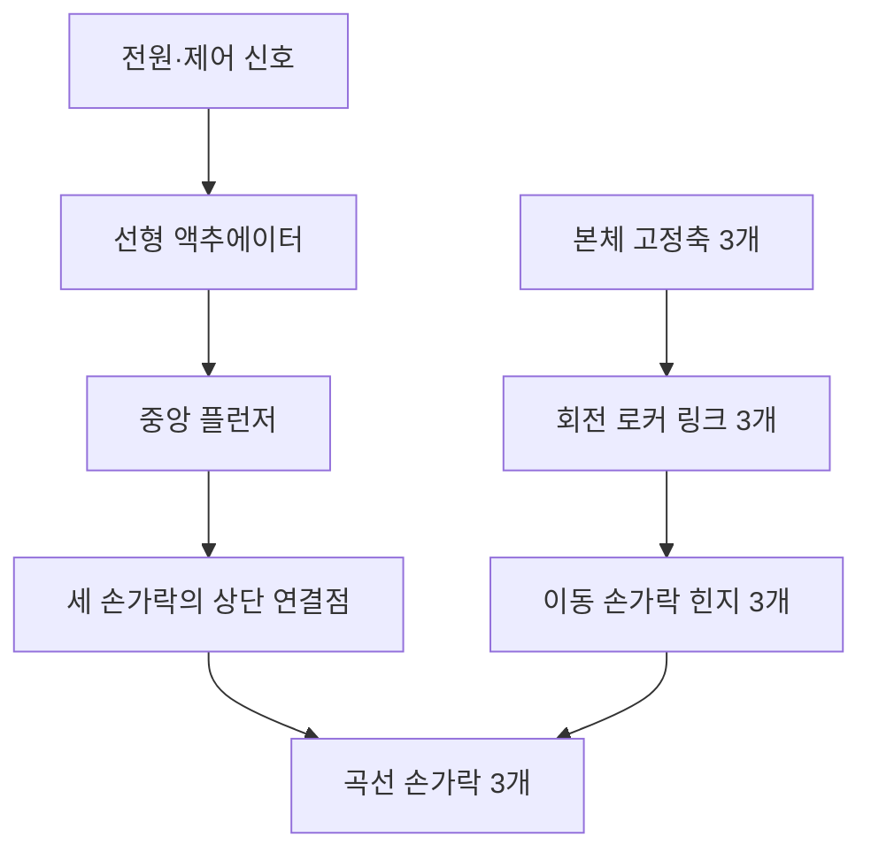
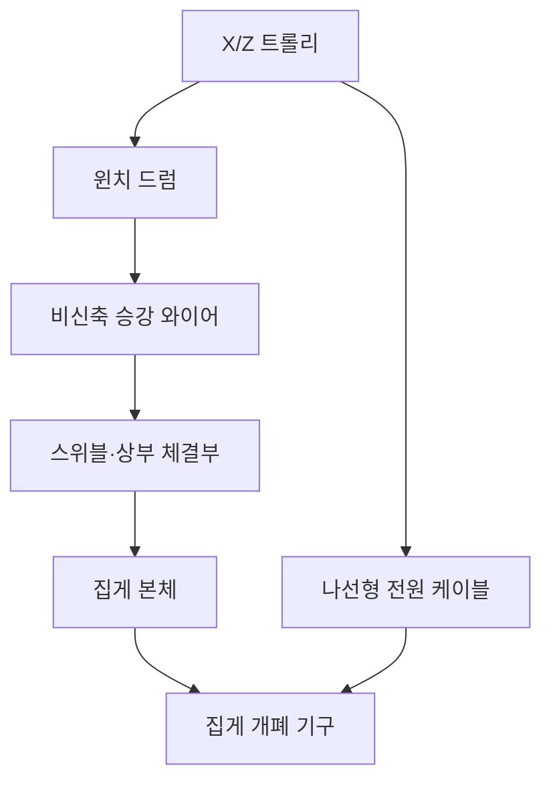

# 실제 인형뽑기 집게 메커니즘 분석 및 3D 구현 명세

## 1. 문서 목적

실제 인형뽑기 기계의 사진에서 확인되는 외부 구조와 동작 상태를 바탕으로,
집게의 기계적 구성과 3D·물리 구현 방향을 정의한다.

이 문서의 목표는 다음과 같다.

- 집게를 단순한 3개의 회전 막대가 아닌 실제 기구에 가까운 형태로 표현한다.
- 손가락, 중앙 액추에이터, 승강 와이어와 전원 케이블의 역할을 분리한다.
- 렌더링 메시와 물리 콜라이더를 분리해 외형과 시뮬레이션 안정성을 함께 확보한다.
- 사진에서 확인되는 사실과 내부 구조에 대한 추정을 구분한다.

## 2. 참고 이미지와 상태

| 구분 | 상태 | 주요 관찰 |
| --- | --- | --- |
| 참고 A | 집게가 올라가 있고 닫힌 상태 | 세 손가락 끝이 중앙으로 모이고 승강 와이어가 거의 노출되지 않음 |
| 참고 B | 집게가 올라가 있고 펼쳐진 상태 | 중앙 하부 슬라이더가 더 노출되고 세 손가락이 바깥쪽으로 회전함 |
| 참고 C | 집게가 내려간 상태 | 중앙의 붉은 와이어가 길게 노출되고 검은 나선 케이블이 별도로 따라 내려옴 |

참고 C를 통해 붉은 중앙선과 검은 나선선의 역할이 서로 다르다는 점을
확인할 수 있다.

- 붉은 중앙선: 집게 하중을 지지하는 승강 와이어
- 검은 나선선: 액추에이터에 전원과 신호를 공급하는 엄빌리컬 케이블
- 우측 투명선처럼 보이는 요소: 집게 부품으로 확정할 근거가 없어 구현에서 제외

## 3. 메커니즘 결론

집게는 중앙의 짧은 직선 운동 하나를 세 손가락의 회전 운동으로 변환하는
공통 구동 구조로 판단된다.



사진 비교상 중앙 하부 구조가 내려온 상태에서 손가락이 펼쳐져 있으므로
다음 관계일 가능성이 높다.

- 플런저 하강: 집게 펼침
- 플런저 상승: 집게 닫힘

원통형 하우징과 짧은 작동 스트로크를 고려하면 솔레노이드 기반 선형
플런저일 가능성이 높다. 다만 내부가 보이지 않으므로 모터와 캠 또는
리드스크루를 사용하는 구조일 가능성도 완전히 배제할 수 없다.

## 4. 손가락 관절 해석

각 손가락은 하나의 연속된 곡선 강체다. 손가락 중간이 꺾이는 2관절
손가락은 아니지만, 구동 기구에는 손가락마다 두 개의 회전축이 존재한다.

사진에서 손가락 위쪽에 보이는 긴 직선 플레이트는 다음 역할을 하는
회전 로커 링크 또는 `claw interconnect`로 해석한다.

- 상단 축을 중심으로 회전하며 고정된 링크 길이 유지
- 링크 하단의 손가락 힌지를 원호 궤도로 이동
- 손가락에 전달되는 굽힘 하중을 본체로 전달
- 플런저의 수직 운동을 손가락 회전으로 변환

따라서 손가락 한 개의 기본 구조는 다음과 같다.

1. 본체에 고정된 상단 회전축
2. 상단 축을 중심으로 회전하는 고정 길이 로커 링크
3. 링크 하단의 이동 손가락 힌지
4. 이동 힌지와 플런저 연결점을 잇는 곡선 손가락의 상단 구간
5. 플런저 연결점의 회전 핀

사진에서 손가락들이 겹쳐 보이는 것은 카메라 투영 때문이다. 실제로는
세 손가락이 원주 방향으로 약 120도씩 떨어진 서로 다른 방사 평면에 있다.

이 문서에서는 몸통과 손가락 힌지를 연결하는 직선 부품을 `로커 링크`로
통일해 부른다. 대화에서 사용한 `레버 암`은 같은 부품을 의미한다.

## 5. 전체 기계 계통

집게의 승강과 개폐는 서로 독립된 계통으로 구성해야 한다.



- 트롤리: 수평 위치와 수평 가속도를 결정한다.
- 윈치: 승강 와이어의 길이만 변경한다.
- 승강 와이어: 집게 하중을 지지하고 진자 운동을 허용한다.
- 스위블: 집게 본체의 Yaw 회전과 와이어 체결점을 중심으로 한 기울어짐을 허용한다.
- 나선형 케이블: 전원과 신호를 전달하며 주 하중을 지지하지 않는다.
- 중앙 액추에이터: 손가락의 개폐만 담당한다.

## 6. 필요한 실제 부품

### 6.1 트롤리 및 승강부

| 부품 | 역할 |
| --- | --- |
| X/Z 트롤리 프레임 | 집게의 수평 이동 |
| 윈치 모터 | 승강 와이어 감기와 풀기 |
| 윈치 드럼 | 와이어 길이 제어 |
| 와이어 가이드 | 드럼에서 와이어가 일정하게 나오도록 안내 |
| 붉은 피복 승강 와이어 | 집게 하중 지지 |
| 상부 체결구 | 와이어와 집게 본체 연결 |
| 스위블 또는 회전 베어링 | 집게의 Yaw 회전과 제한된 Pitch·Roll 허용 |
| 검은 나선형 전원 케이블 | 집게 액추에이터 전원·신호 공급 |
| 스트레인 릴리프 | 케이블 단선과 커넥터 하중 방지 |

현재 트롤리 본체의 렌더 하우징은 한 변 `0.64m`인 정육면체로 표현한다.
레일, 전면 패널과 윈치 드럼은 기존 조립 관계를 유지하며, 트롤리 하우징은
렌더 전용이므로 이 외형 변경이 집게 이동이나 와이어 물리에 영향을 주지 않는다.

### 6.1.1 브리지 주행 구동부

브리지는 고정 측면 봉 위를 스스로 굴러가야 하므로, 좌측 엔드 플레이트에
바퀴를 돌리는 기어드 구동부가 붙는다. 이 부품이 없으면 갠트리는 구동원 없이
움직이는 기구가 된다.

구동부는 **기어케이스 하나**로만 표현한다. 좌측 엔드 플레이트 내측면에 볼트로
고정되고 브리지 봉 3개의 끝단을 감싸는 상자이며, 케이스 상단이 레일 바퀴 축
높이까지 올라와 좌측 바퀴 2개를 돌린다. 우측 2개는 유동륜이다.

모터, 점검 커버, 단자함과 배선은 별도 메시로 만들지 않는다. 케이스 안에 있거나
모델링하지 않은 것으로 두어 여섯 면이 모두 평면으로 남는다. 내측면은 캐리지의
스토퍼이므로 평면이어야 하고, 나머지 면에 돌출부가 없으면 계측할 것도
케이스 자기 면뿐이다. 플레이트 쪽 볼트 플랜지만 예외로 남긴다.

기어케이스는 엔드 플레이트보다 안쪽으로 `0.28m` 더 들어오고, 그 내측면이
캐리지의 좌측 기계적 끝단이 된다. 따라서 X축 이동 범위는 좌우 대칭이 아니다.

```text
travelMaxX =  엔드 플레이트 내측면 - 캐리지 절반  (우측)
travelMinX = -(기어케이스 내측면  - 캐리지 절반)  (좌측)
```

기본 치수에서 `travelMaxX = 2.262m`, `travelMinX = -1.982m`이다. 배출구는
`x = +2.28m`에 있어 도달 판정에 영향이 없고, 상품 적재 격자의 가장 왼쪽 열은
`x = -1.72m`이므로 모든 인형이 여전히 사정거리 안에 있다.

브리지 질량은 `4.8kg`이고 봉·타이·플레이트·기어케이스에 분배한다. 기어케이스가
전체의 `26%`를 차지하므로 Z축은 한쪽으로 치우친 실제 부하를 가속한다. 분배
비율의 합은 `tests/drive-axis.test.mjs`에서 검증한다.

### 6.2 집게 본체

| 부품 | 역할 |
| --- | --- |
| 상부 캡 | 와이어 및 케이블 연결부 보호 |
| 원통형 하우징 | 액추에이터와 플런저 수용 |
| 외장 칼라 | 하우징 표면에 밀착된 수평 밴드로 결합부와 단차 표현 |
| 선형 액추에이터 | 개폐에 필요한 직선 힘 생성 |
| 중앙 플런저 | 액추에이터 힘을 하부로 전달 |
| 가이드 부싱 | 플런저의 좌우 흔들림 억제 |
| 복귀 스프링 | 전원 해제 시 기본 상태로 복귀 |
| 공통 슬라이더·허브 | 하나의 플런저 운동을 세 공통 힌지 핀에 직접 분배 |
| 하부 스파이더 | 세 상단 회전축을 120도 간격으로 고정 |

### 6.3 손가락 구동부

| 부품 | 역할 |
| --- | --- |
| 로커 링크 3개 | 손가락 힌지를 고정 반경의 원호로 안내 |
| 공통 힌지 핀 9개 | 본체 피벗·이동 힌지·플런저 연결부에 같은 표준 핀 사용 |
| 부싱·와셔·고정링 | 마찰과 축 방향 유격 관리 |
| 열림·닫힘 스토퍼 | 관절 한계와 손가락 관통 방지 |
| 2단 곡률 손가락 3개 | 별도 패드 없이 전체 금속 표면으로 인형 접촉과 파지 |

### 6.4 외형 디테일

- 하우징 결합선과 단차
- 외장 칼라는 몸통을 관통하는 세로 고리가 아니라 Y축 두께가 얇은 수평 원통으로 표현
- 육각 볼트와 원형 핀 헤드
- 브래킷의 절곡선
- 링크 플레이트의 슬롯과 구멍
- 와셔와 스냅링
- 금속 표면의 미세한 스크래치와 반사 왜곡

### 6.5 머신 캐비닛

현재 외장 디자인은 ToysPop Mini 계열의 소형 모듈형 머신을 참고하되,
단일 플레이 공간과 `CLAWPICK` 자체 브랜드로 재구성한다.

| 부품 | 구현과 역할 |
| --- | --- |
| 하부 서비스 캐비닛 | 펄 화이트 라운드 외장, 서비스 도어, 잠금장치, 환기구와 높이 조절 발 |
| 전면 조작대 | 핑크 라운드 패널, 조이스틱, 발광 버튼, 상태 표시창과 카드 리더 |
| 상품 배출구 | 내부 낙하구를 감싸는 하나의 투명 아크릴 터널과 전면 우측의 어두운 `PRIZE OUT` 플랩 |
| 유리 인클로저 | 장식 없는 전·후·좌·우 네 장의 두꺼운 강화유리 |
| 외부 프레임 | 세로 코너 기둥 없이 유리 상·하단만 잡는 펄 화이트·핑크 수평 트림 |
| 상단 간판 | 핑크 루프 캡, 발광 화이트 패널과 `CLAWPICK MINI` 로고 |
| 내부 조명 | 유리 상단의 수평 시안 LED와 좌우 내부 조명 |

기존 물리 플레이필드와 벽 Collider는 유지한다. 외장 렌더링은 물리 벽보다
상세하지만, 충돌은 기존 단순 Cuboid Collider가 담당한다. 하부 서비스
캐비닛은 플레이필드 아래에 배치해 인형과 집게 물리를 변경하지 않는다.
상품 낙하구의 아크릴 가이드는 예외로, 보이는 벽과 같은 외곽선에서 파생한
단순 Cuboid Collider를 사용해 주변 인형이 낙하구로 밀려 들어가는 것을 막고
파지된 인형을 센서 영역으로 안내한다. 가이드는 유리 인클로저와 같은 방식으로
네 장의 낱장 패널이 아니라 구멍이 뚫린 하나의 얇은 터널을 압출해 만들고,
두께는 강화유리와 같은 `GLASS.thickness`를 읽는다. 낱장 패널은 각각 `1.2`를
가로지르는데 그 패널들이 이루는 터널의 외곽은 `1.205`여서 네 모서리마다
`2.5mm` 틈이 남았다. 인형이 닿는 내측면 위치는 패널 시절과 같다.

## 7. 3D 객체 계층

```text
MachineFrame
├─ LowerServiceCabinet
├─ PrizeDeck
├─ TemperedGlassEnclosure
├─ RoundedCabinetFrame
├─ IlluminatedMarquee
├─ FrontControlFascia
├─ GantryBridge
│  ├─ BridgeRod × 2
│  ├─ TieRod
│  ├─ EndPlate × 2
│  ├─ RailWheel × 4
│  └─ TravelDrive
│     └─ Gearcase
└─ Trolley
   ├─ WinchDrum
   ├─ PowerUmbilical
   └─ HoistCable
      └─ SuspensionSwivel
         └─ ClawBody
            ├─ UpperCap
            ├─ ActuatorHousing
            ├─ PlungerVisual
            └─ FingerAssemblyVisual × 3
               ├─ FixedBracket
               ├─ RockerLink
               ├─ HingePin
               └─ CurvedFingerVisual

PhysicsScene
├─ ClawBodyRigidBody
├─ PlungerCollider
├─ RockerLinkCollider × 3
└─ CurvedFingerCollider × 3
```

집게 본체 전체를 트롤리의 자식으로 직접 고정하면 안 된다. 트롤리와 집게
사이에는 길이 제약을 가진 와이어가 존재해야 하며, 트롤리 가속과 정지에
의해 집게가 자연스럽게 흔들려야 한다.

`PlungerVisual`, `RockerLink`, `CurvedFingerVisual`은 각각 대응하는
동적 RigidBody의 자식이다. 렌더 메시와 충돌체가 동일한 물리 변환을
공유하므로 별도 월드 자세 복사나 키네마틱 추종 지연이 발생하지 않는다.

## 8. 좌표와 관절 배치

Y축을 위쪽으로 정의하고 세 손가락의 원주 배치각을 다음과 같이 둔다.

```text
φ₀ = 0°
φ₁ = 120°
φ₂ = 240°
```

각 손가락은 중심에서 바깥쪽으로 향하는 방사형 수직 평면 안에서 움직인다.
손가락의 힌지 축은 해당 방사 방향과 수직인 접선 방향이어야 한다.

배치각이 `φ`인 손가락의 힌지 축은 개념적으로 다음과 같다.

```text
hingeAxis = (-sin φ, 0, cos φ)
```

세 손가락에 동일한 월드 축을 사용하면 모두 같은 방향으로 접히거나 서로
관통하게 된다.

## 9. 링크 기구학

중앙 플런저 위치를 하나의 공유 상태 `q`로 사용한다.

- `A`: 본체에 고정된 로커 링크 상단 피벗
- `B(q)`: 원호를 따라 움직이는 손가락 힌지
- `C(q)`: 수직 이동하는 플런저 연결점
- `l₁`: 로커 링크 `A-B`의 고정 길이
- `l₂`: 곡선 손가락 상단 `B-C`의 고정 길이
- `θ`: 손가락 회전각

두 강체 구간의 길이는 고정되어 있으므로 다음 조건을 동시에 만족해야 한다.

```text
|B(q) - A| = l₁
|C(q) - B(q)| = l₂
```

`B`는 `A` 중심 반지름 `l₁`인 원과 `C` 중심 반지름 `l₂`인 원의 바깥쪽
교점이다. 플런저가 상승하면 `B`가 본체 바깥쪽으로 이동하고, `B-C` 방향으로
손가락 각도 `θ`가 결정된다.

단순하게 다음과 같이 선형 보간하는 방식은 피한다.

```text
θ = lerp(openAngle, closeAngle, closeProgress)
```

선형 보간은 링크의 기계적 이득 변화와 끝단 부근의 속도 변화를 표현하지
못해 움직임이 애니메이션처럼 보이기 쉽다.

## 10. 권장 물리 구현

### 10.1 현재 폐쇄 링크 방식

현재 구성은 다음과 같다.

- 집게 본체: 동적 RigidBody
- 몸통 회전: X·Y·Z 세 회전축을 모두 허용하고 상부 체결점의 힘으로 자세 결정
- 승강 와이어: 비신축 길이 제약
- 중앙 플런저: 몸통과 Prismatic Joint로 연결된 동적 RigidBody
- 로커 링크: 몸통 피벗과 Revolute Joint로 연결된 동적 RigidBody 3개
- 곡선 손가락: 로커 링크와 플런저 양쪽에 Revolute Joint로 연결된 동적 RigidBody 3개
- 구동 입력: 열림·닫힘 방향, 플런저 속도 제한과 최대 축력
- 끝단 제어: 마지막 `3mm`에서 축력을 연속적으로 낮추고 끝단에서 최대 축력의 `10%` 유지
- 인형 접촉: 동적 곡선 손가락의 단순 복합 콜라이더가 처리

게임 상태는 손가락이나 로커 각도를 직접 변경하지 않고 플런저 직선 조인트의
열림·닫힘 방향만 변경한다. 플런저는 해당 방향으로 실제 축력을 받고 물리
솔버가 `A-B`, `B-C`의 고정 길이와 각 회전축의 일치를 동시에 풀어 로커,
이동 힌지와 손가락 자세를 결정한다.

렌더 메시와 콜라이더는 각각 같은 동적 RigidBody의 자식이다. 별도 월드
자세를 추종하거나 `setNextKinematicTranslation`으로 다음 프레임 위치를
예약하지 않으므로, 본체 이동 시 링크가 한 물리 틱 뒤늦게 따라오지 않는다.

한 손가락의 루프는 `몸통 → 로커 → 손가락 → 플런저 → 몸통` 순서로
닫힌다. 이 구조를 120도 간격으로 세 번 배치하고 중앙 플런저를 공유한다.

### 10.2 안정성 튜닝

폐쇄 링크는 다음 원칙으로 관리한다.

- 모든 링크 기준 길이를 동일한 기구학 계산값에서 생성
- 플런저는 Y축 Prismatic Joint로 회전과 횡이동을 차단
- 로커와 손가락의 모든 핀은 접선축 Revolute Joint만 허용
- 플런저에만 열림·닫힘 방향의 축력을 적용하고 나머지 링크에는 별도 모터나 애니메이션을 적용하지 않음
- 링크끼리의 자체 충돌을 제외해 조인트 구속과 접촉 구속이 충돌하지 않도록 함
- 손가락·로커·플런저 질량을 몸통보다 충분히 작고 서로 비슷한 범위로 설정
- Rapier solver iteration을 늘려 세 폐쇄 루프의 앵커 오차를 줄임
- 렌더 메시와 단순 복합 콜라이더를 같은 동적 RigidBody에 배치
- 초기 자세는 해석 기구학 값으로 생성해 모든 조인트 앵커가 처음부터 일치

### 10.3 물리 튜닝 단위

튜닝 패널에는 내부 보정 계수 대신 실제 물리량을 노출한다.

| 항목 | 단위 | 물리적 의미 |
| --- | --- | --- |
| 트롤리 최고 속도 | `m/s` | XZ 평면 목표 이동 속도 |
| 트롤리 가속도 | `m/s²` | 목표 속도까지의 가감속률 |
| 와이어 하강·상승 속도 | `m/s` | 비신축 와이어 목표 길이 변화율 |
| 플런저 속도 | `m/s` | 해당 방향의 축력을 차단하기 시작하는 상대 속도 |
| 플런저 최대 축력 | `N` | 이동 중 플런저와 몸통 사이에 적용하는 축력 |
| 마찰계수 | `μ` | Rapier Collider의 무차원 Coulomb 마찰계수 |
| 몸통 선형·회전 감쇠 | `s⁻¹` | 와이어에 매달린 집게 본체의 속도 감쇠계수 |
| 인형 질량 | `kg` | 인형 복합 Collider의 총질량 |
| 중력 | `m/s²` | 물리 월드의 Y축 중력 가속도 |

플런저에는 위치 스프링이나 PD 위치 제어기를 사용하지 않는다. 닫힘 명령은
상승 방향, 열림 명령은 하강 방향의 축력을 만든다. 해당 방향의 상대 속도가
`plungerSpeed`에 도달하면 구동 축력을 차단하고, 속도가 낮아지면 다시
축력을 적용한다. 플런저와 몸통에는 크기가 같고 방향이 반대인 힘을 적용해
액추에이터의 내부 반작용을 표현한다.

끝단에서 남은 이동 거리에 따른 축력 배율은 다음과 같다.

```text
남은 거리 ≥ 3mm: 100%
남은 거리 = 1.5mm: 55%
남은 거리 = 0mm: 10%
```

이 연속 보간은 빈 집게가 Prismatic Joint 끝단을 최대 축력으로 계속
누르면서 발생시키는 수직 진동을 줄인다. 인형에 막혀 끝단에서 `3mm` 이상
떨어진 경우에는 축력을 낮추지 않으므로 최대 파지력이 유지된다. 손가락에
직접 토크를 적용하지 않으며 실제 힌지 토크는 플런저 축력과 링크의 순간
기계적 이득으로 결정된다.

다음 세 값은 물리 힘을 생성하는 변수가 아니라 게임 단계 전환 판정값이다.

| 항목 | 용도 |
| --- | --- |
| 플런저 위치 허용 오차 | 열림·닫힘 목표 도달 판정 |
| 플런저 속도 허용 오차 | 목표 위치에서 정지했는지 판정 |
| 부하 정지 제한 시간 | 인형에 막혀 끝단에 도달하지 못한 상태의 완료 판정 |

제동 가속도, 정착 시간, 모터 감쇠비, 힘 응답 거리, 이동·파지 선행 거리,
파지 진입 거리, 파지 감쇠 배율, 열림 속도 배율과 조절 가능한 닫힘
스트로크는 설정과 구동 계산에서 제거했다. 링크·손가락·플런저의 개별
선형·회전 감쇠도 지정하지 않아 Rapier 기본값을 사용한다.

프리셋 형식은 버전 4를 사용한다. 이전 버전의 `closeSpeed`,
`clawStrength`, `swingDamping`은 현재 단위로 변환하고, 제거된 플런저
서보·감쇠 속성은 저장 설정 마이그레이션에서 폐기한다.

### 10.4 현재 구현의 책임 분리

| 구성 요소 | 구현 방식 | 책임 |
| --- | --- | --- |
| 집게 본체 | 3축 회전 Dynamic RigidBody | 중력, 와이어 장력, 수평 이동 관성, 진자 운동과 몸통 회전 |
| 플런저 | Dynamic RigidBody + Prismatic Joint | 유일한 축력 입력, 중심축 스트로크와 핀 힘 전달 |
| 로커 링크 | Dynamic RigidBody × 3 + Revolute Joint | 몸통 피벗에서 회전하며 `A-B` 길이 유지 |
| 손가락 | Dynamic RigidBody × 3 + Revolute Joint × 2 | 곡선 날 접촉과 로커–플런저 사이 힘 전달 |
| 승강 와이어 | Rope Joint | 비신축 최대 길이와 진자 운동 |
| 브리지 주행 구동부 | 브리지 강체의 Cuboid Collider 1개 | 브리지 질량의 `26%`와 Z축 편심 부하, 캐리지의 좌측 끝단 |
| 출구 가이드·몸통 윗면 | 기존 몸통 Collider + 가이드 Cylinder Collider | 완전 상승 시 접촉으로 Pitch·Roll 과회전 제한 |
| 전원 케이블 | 시각 전용 곡선 | 느슨한 나선형 엄빌리컬 표현 |

`getClawPoseFromPlungerY(q)`는 초기 앵커 정렬, 치수 검증과 완료 조건
계산에 사용한다. 실행 중 자세는 Rapier 폐쇄 링크 솔버가 결정한다.

### 10.5 구현 변경 이력과 이유

| 단계 | 방식 | 확인된 문제 | 결정 |
| --- | --- | --- | --- |
| 1 | 플런저·로커·손가락을 모두 동적 바디와 폐쇄형 조인트로 연결 | 다중 폐쇄 루프가 과구속되어 하강 정지, 공중 고정, 본체 분리 발생 | 폐기 |
| 2 | 각 부품을 별도 키네마틱 바디로 만들어 본체 월드 자세 추종 | 물리 스텝 순서 때문에 한 프레임 지연과 연결부 이격 발생 | 폐기 |
| 3 | 로커 링크만 몸통 자식으로 고정 | 몸통–로커 피벗은 안정됐지만 플런저–몸통과 로커–손가락에 미세 이격 잔존 | 과도 단계 |
| 4 | 보이는 플런저·로커·손가락을 모두 몸통 로컬 계층으로 통합 | 명목상 연결점이 동일 프레임에서 일치하지만 디버그 화면에서 링크 물리 형상이 누락 | 이전 방식 |
| 5 | 플런저 Y 변위를 단일 입력으로 사용하고 플런저·로커·손가락 복합 충돌체에 동일한 해석 자세 적용 | 안정적이지만 별도 Kinematic 바디가 몸통보다 한 물리 틱 늦게 추종 | 이전 방식 |
| 6 | 초기 앵커 정렬, 자체 충돌 제외, 질량 균형과 solver 보강 후 세 폐쇄 루프 재구성 | 몸통과 링크가 실제 조인트 힘을 공유하고 추종 지연 제거 | 현재 방식 |
| 7 | 위치 오차 기반 PD 축력을 열림·닫힘 방향의 제한 축력으로 교체 | 서보 계수와 목표점 반동을 제거하고 인형 저항이 실제 스트로크를 결정 | 현재 방식 |
| 8 | Prismatic Joint 끝단 전 `3mm`에서 축력을 `100% → 10%`로 연속 감소 | 빈 닫힘 상태의 끝단 반력과 폐쇄 링크 보정이 만드는 수직 진동 완화 | 현재 방식 |

집게 관련 링크 바디는 본체 1개, 플런저 1개, 로커 3개와 손가락 3개로
구성한다. 플런저 직선 조인트 1개와 회전 조인트 9개가 모든 링크를
연결하며, 인형 접촉력은 손가락에서 로커·플런저를 거쳐 몸통으로 전달된다.

폐쇄 링크 결합 방식은 다음 시나리오에서 검증했다. 이후 추가한 방향 기반
축력과 끝단 감쇠 정책은 자동 테스트로 계산 결과를 검증했으며 실제 UI
체감 검증은 아직 수행하지 않았다.

1. 올라간 열린 상태에서 플런저와 세 연결부 정렬
2. 열린 상태 하강과 와이어 길이 증가
3. 플런저 상승에 따른 세 손가락 닫힘
4. 인형 접촉과 들어 올림
5. 상승 후 배출구 이동
6. 전 과정에서 공중에 남는 링크나 본체 분리 없음

### 10.6 현재 알려진 한계

플런저, 로커와 손가락은 하나의 Prismatic Joint와 아홉 개의 Revolute
Joint로 연결된 세 개의 폐쇄 루프다. 빈 상태로 완전히 닫히면 플런저의
상승 축력, Prismatic Joint의 끝단 반력과 폐쇄 링크의 앵커 보정이 동시에
작용한다. 인형을 파지했을 때는 손가락 접촉과 인형의 질량·마찰·감쇠가 힘을
분산하고 플런저가 끝단에 직접 도달하지 않아 같은 진동이 거의 나타나지
않는다.

현재는 끝단 `3mm` 축력 램프와 `10%` 유지 축력으로 이 현상을 완화한다.
이는 실제 UI에서 체감 검증하기 전의 내부 정책이며, 별도의 접촉 센서나
명시적인 `구동/끝단 유지` 상태 머신은 아직 없다. 진동이 남는 경우에는
다음 순서로 보강한다.

1. 끝단 진입·이탈 거리가 다른 히스테리시스 상태 도입
2. 기계식 스토퍼에 짧은 컴플라이언스와 낮은 반발계수 적용
3. 플런저 상대 변위·속도와 조인트 반력을 계측해 solver 오차와 접촉 반동 분리

인형 접촉 자체를 축력 감소 조건으로 사용하면 파지력이 약해지므로 금지한다.

### 10.7 의도적 유격 추가 원칙

유격은 명목상 연결점이 완전히 일치한 현재 구조 위에만 추가한다. 프레임
지연이나 좌표 불일치를 유격처럼 남겨두지 않는다.

- 몸통–로커 상단 피벗: 접선축 기준 약 `±1~2°`의 제한된 회전 백래시
- 핀과 구멍 사이: 실제 치수 확인 전에는 시각적으로 `1~3mm` 이내의 이동
- 플런저: 중심축 이탈 없이 가이드 부싱 안에서 미세한 회전 또는 충격만 허용
- 흔들림 발생 조건: 트롤리 가감속, 스토퍼 접촉, 인형 충돌
- 복귀 방식: 감쇠된 짧은 진동 후 명목 자세로 복귀
- 금지 사항: 입력과 무관하게 계속 반복되는 사인파 진동

유격 상태는 렌더링 오프셋으로 먼저 검증하고, 파지 결과에 영향을 줄 필요가
확인된 경우에만 충돌체 자세에도 제한적으로 반영한다.

## 11. 승강 와이어와 흔들림

승강 와이어는 신축성 있는 스프링이 아니다.

- 와이어 길이는 윈치 속도에 따라 직접 증가하거나 감소한다.
- 장력 방향의 거리 오차는 즉시 투영해 제거한다.
- 접선 방향 속도는 보존해 진자 운동을 유지한다.
- 트롤리 이동 시 집게 위치를 직접 복사하지 않는다.
- 트롤리 가속과 감속이 집게 흔들림의 원인이 되어야 한다.
- 집게 본체의 X·Y·Z 회전을 잠그지 않는다.
- Rope Joint는 몸통 중심이 아니라 상부 체결점에 연결한다.
- 상부 체결점의 장력, 무게중심, 관성과 인형 충돌이 몸통 자세를 결정한다.
- 별도 회전 애니메이션이나 인위적인 회전 토크는 적용하지 않는다.
- 완전 상승 위치에서는 출구 가이드와 집게 몸통의 넓은 윗면이 접촉해 Pitch·Roll 과회전을 막는다.
- 와이어 길이 보정은 체결점 속도로 오차를 측정하되, 보정량만 몸통 중심의 선형 속도에 더한다.

올라간 상태에서는 윈치 출구와 집게 상부 캡 사이의 최소 길이를 작게 하여
붉은 와이어가 거의 보이지 않도록 한다. 내려간 상태에서는 참고 C처럼
와이어가 중앙에서 곧게 장력을 받는 모습이 보여야 한다.

진자 운동은 집게 전체의 위치가 와이어 아래에서 왕복하는 운동이고, 몸통
회전은 같은 위치에서도 집게의 방향이 바뀌는 운동이다. 현재 구현은 두
운동을 분리하지 않고 하나의 동적 RigidBody와 편심된 상부 Rope Joint로
함께 계산한다. Yaw는 축 비틀림이나 비대칭 충돌로 발생하고, Pitch·Roll은
트롤리 가감속과 상부 체결점의 장력에 의해 발생할 수 있다.

와이어 출구의 원통 Mesh와 Kinematic Cylinder Collider는 중심 위치와
반지름 `0.22m`, 전체 높이 `0.08m`를 정확히 공유한다. 별도의 상부
목 Collider는 사용하지 않고 반지름 `0.22m`인 기존 몸통 Collider의 넓은
윗면이 가이드와 직접 충돌한다. 가이드와 몸통은 일반 환경 충돌을 유지하면서
서로도 충돌하도록 그룹을 구성하며, 가이드 마찰은 `0.12`, 반발계수는 `0`을
사용한다. 완전 상승 시 수직 간격과 몸통 반지름으로 약 `30~35°`의
Pitch·Roll 여유가 형성되고 이후 몸통 윗면이 내부 스토퍼에 접촉한다.
자세를 직접 덮어쓰거나 복원 토크를 가하지 않으므로 접촉 범위 밖에서는
기존 3축 회전이 유지된다. 원통은 축대칭이므로 Yaw 회전은 제한하지 않는다.

출구 가이드의 원통 외장 Mesh, 하단 테두리 Mesh, 내부 스토퍼 Collider,
Rope Joint 앵커는 하나의 `WireExitGuide` Kinematic RigidBody에 속한다.
따라서 트롤리 이동 시 각 요소를 별도 좌표로 동기화하지 않고 동일한 Transform을
공유하며, 렌더링 외형과 충돌 위치 및 와이어 체결점이 함께 이동한다.
몸통 상단의 작은 체결 목과 고리형 테두리 Mesh는 사용하지 않으며, 와이어는
단일 몸통 Collider의 윗면인 로컬 `y=0.40m`에 직접 체결한다.

Rope Joint의 상단 로컬 앵커는 가이드 중심이 아니라 원통 Collider의 하단
출구인 `y=-0.04m`에 둔다. 승강 와이어 Mesh 시작점, 실제 길이와 진자 각도
계산점 및 집게 초기 위치도 같은 출구 좌표를 사용한다. 따라서 수축 길이는
가이드 내부 길이를 포함하지 않고 `가이드 하단 출구 ↔ 몸통 윗면` 사이의
외부 와이어 길이를 뜻한다. 예를 들어 `0.01m`는 두 충돌면 사이에 실제
`0.01m` 간격을 남기며, Rope Joint와 접촉 구속이 서로 반대 방향으로 몸통을
보정하지 않는다.

수축 길이는 물리 튜닝값이 아니라 `0.01m` 고정 기계 치수다. 최대 길이는
사용자가 직접 입력하지 않고, 열린 집게가 수직으로 내려왔을 때 손가락
최하단 외면이 상품 적재 바닥의 물리면 `y=0`에서 `0.01m` 위에 위치하도록
자동 계산한다.

```text
최대 길이
= 가이드 출구 높이
  - 몸통 와이어 체결점 높이
  + 열린 손가락 최하단의 몸통 기준 Y
  - (상품 바닥 높이 + 0.01m)
```

열린 손가락 최하단은 끝점 중심뿐 아니라 판재 두께의 절반까지 포함한다.
집게 부품 스펙에서 손가락 길이나 두께를 변경하면 최대 와이어 길이도 즉시
다시 계산된다. 상품 바닥 Collider와 계산식은 같은 바닥 높이 상수를
공유하므로 바닥 높이 변경 시에도 두 값이 분리되지 않는다. 수축·최대 길이
항목은 물리 튜닝과 프리셋에서 제거한다.

회전 중인 체결점 속도는 `몸통 중심 선형 속도 + ω × r`이다. 체결점 속도
전체를 RigidBody의 선형 속도로 다시 설정하면 `ω × r`이 다음 프레임에
중복되어 회전 에너지가 증가한다. 따라서 현재 구현은 체결점의 방사 속도
오차만 계산한 뒤 그 보정 벡터를 기존 몸통 중심 선형 속도에 더한다.

검은 나선 케이블은 승강 와이어와 별도의 곡선으로 표현한다.
20개 구간으로 나눈 중심축 입자 체인에 현재 물리 설정과 같은 중력, 속도 감쇠와 반복 거리 구속을
적용하고 양 끝만 트롤리와 집게 몸통에 고정한다. 따라서 중간 구간은 중력
방향으로 처지고 트롤리와 집게의 이동을 지연해서 따라가며 흔들린다.
이 동역학은 렌더링 전용 단방향 계산이므로 집게 RigidBody에 반작용을
가하거나 승강 와이어의 하중을 대신 지지하지 않는다.

몸통 쪽 코일 중심축 앵커는 몸통 표면에 두지 않는다. `몸통 반지름 + 코일
외경의 절반 + 0.008m`만큼 중심에서 떨어진 위치를 매 프레임 몸통 회전에
맞춰 계산한다. 따라서 전체 코일 외곽이 몸통 Collider 밖에 남는다.
PBD 거리 구속을 반복할 때 같은 자세의 확장 원통 충돌 구속도 함께 풀어,
자유 입자가 몸통 내부에 들어오면 가장 가까운 측면 또는 상·하단 밖으로
투영한다. Catmull-Rom 보간으로 입자 사이에 새로 생성된 렌더 샘플도 같은
확장 원통 밖으로 다시 투영해 곡선 보간 오버슈트에 의한 관통을 막는다.

동적 중심축은 Catmull-Rom 곡선으로 보간한 뒤 누적 거리 기준 96개 구간으로
등거리 샘플링한다. 각 샘플의 접선에 평행 이동 프레임을 구성하고 일정한
코일 반지름으로 나선을 생성하므로 연결부와 중앙의 코일 외경이 같다.
회전 수는 케이블 전체에서 고정되며 중심축 길이가 변할 때 피치가 전 구간에서
균일하게 늘거나 줄어든다.

나선 경로는 짧은 원통 인스턴스를 이어 붙이지 않는다. 최대 크기의
`BufferGeometry`를 한 번 생성하고, 경로를 따라 공유 링 정점과 노멀을
갱신하는 하나의 연속 Tube Mesh로 렌더링한다. 인접 구간이 같은 링 정점을
공유하므로 원통 절단면, 구간 사이 틈과 겹침이 보이지 않으며 케이블 전체가
한 번의 Draw Call로 렌더링된다.

코일 마지막 점에서 몸통 표면까지는 12개 세그먼트의 짧은 Cubic Bézier
리드선을 추가한다. 시작 접선은 마지막 코일 방향을 따르고 종료 접선은 몸통
안쪽을 향하므로 나선이 갑자기 꺾이지 않는다. 리드선 끝 중심은 케이블
반지름의 35%만큼 몸통 표면 안으로 들어가도록 해 별도 소켓 Mesh 없이도
케이블이 몸통에 연결된 것처럼 보이게 한다. 이 의도적인 끝단 겹침을 제외한
코일과 자유 중심축에는 몸통 관통을 허용하지 않는다.

몸통 연결점은 단일 원통 Collider의 옆면을 그대로 사용하지 않는다. 여러
Mesh로 구성된 외형 중 최상단 테이퍼 원통 기둥의 옆면 중앙을 기준으로 하며,
기본 모델의 `y=0.29m`와 중앙 반지름 `0.1875m`를 사용자가 변경한 몸통 높이와
지름에 맞춰 스케일링한다. 따라서 케이블 끝이 넓은 몸통 중단이 아니라 실제
보이는 최상단 기둥에 붙는다.

트롤리 쪽에도 12개 세그먼트의 연결 리드선을 둔다. 체결점은 와이어 가이드가
아니라 정육면체 트롤리 본체의 왼쪽 옆면 중앙이다. 케이블 중심을 선경의
35%만큼 옆면 안으로 넣어 별도 소켓 없이 연결되어 보이게 한다. 리드선의
처음 절반은 옆면 바깥쪽으로 향하는 완전한 직선이고, 이후 Cubic Bézier
전이부가 아래쪽 첫 코일의 위치와 접선으로 연결된다. PBD 중심축 시작점은
체결점보다 `0.14m` 아래이면서 `코일 외경/2 + 0.008m` 이상 바깥에 두므로,
나선 외곽이 트롤리 본체를 통과하지 않는다.

기본 케이블 선경은 `0.06m`, 코일 외경은 `0.14m`, 나선 회전 수는 `28회`,
경로 세그먼트는 `280개`, 직선거리보다 추가되는 중심축 여유 길이는
`0.24m`이다. 다섯 값은 우측
`집게 부품 스펙`의 `나선형 전원공급 케이블` 항목에서 변경한다. 코일
외경은 항상 케이블 선경보다 최소 `0.02m` 크게 정규화한다. 케이블에는
Collider를 두지 않는다. 여유 길이는 최대 `2.0m`, 나선 회전 수는 최대
`120회`, 경로 세그먼트는 `48~1200개`까지 설정할 수 있다. Tube는 설정한
길이 방향 세그먼트와 10각형 원형 단면을 사용한다. 설정한 전체 세그먼트
중 최대 12개씩은 트롤리와 몸통 연결 리드선에 사용하고 나머지는 코일
경로에 사용한다.

- 집게를 지탱하지 않음
- 내려갈 때 코일 간격 또는 전체 곡선 길이가 증가
- 집게 주변에서 느슨한 곡률 유지
- 물리 충돌은 생략하거나 매우 단순화
- 필요하면 집게 회전에 약한 감쇠만 추가

## 12. 곡선 손가락 메시

손가락은 원형 파이프가 아니라 납작한 금속 스트립에 가까운 단면으로
제작한다.

권장 형상은 다음과 같다.

1. 플런저 연결점에서 이동 힌지까지의 상단 구간은 직선에 가까운 판재로
   유지하며 힌지에서 첫 번째 각을 만든다.
2. 힌지 아래 구간은 바깥쪽 아래로 비교적 곧게 내려온다.
3. 중간과 하단 사이에서 곡률이 집중된 두 번째 각을 만들되 모서리는
   급격한 절곡이 아니라 둥근 전이로 처리한다.
4. 두 번째 각 아래는 곡선과 접선이 이어지는 충분한 길이의 직선 구간으로
   내려온다.
5. 별도 고무 패드나 타원형 끝단 부품을 부착하지 않고 같은 금속 스트립으로
   끝까지 연속되게 만든다.

코드의 손가락 경로는 `상단 LineCurve3 → 중간 CubicBezierCurve3 → 하단
LineCurve3` 세 구간으로 구성한다. 전체 길이는 유지하면서 상단 직선을
줄이고 곡률을 위로 이동해 하단 직선의 길이를 확보한다. 중간 Bézier의
시작·종료 핸들은 동일한 원호 근사식으로 계산한 길이를 사용해 곡률이
끝부분에 몰리지 않도록 하고, 약 `67°`의 방향 전환을 균일하게 분배한다.

Blender에서는 Bezier Curve와 직사각형 Bevel Object를 사용하는 것이
적합하다. 코드에서 생성할 경우 2D 곡선을 따라 둥근 직사각형 단면을
스윕하는 방식이 좋다.

일반적인 원형 `TubeGeometry`만 사용하면 사진의 절곡 금속 느낌이 약해진다.

## 13. 렌더링 메시와 충돌체

렌더링 메시와 물리 충돌체는 형상 객체로는 분리하지만, 가동부별로 동일한
동적 RigidBody와 공통 치수 정의를 사용한다.

### 렌더링 메시

- 매끄러운 연속 곡선
- 실제 두께와 폭
- 길이 방향으로는 노멀을 연속 보간해 곡선을 매끄럽게 표현
- 사각 단면의 네 면은 정점을 분리해 모서리 노멀을 날카롭게 유지
- 시작·끝 캡도 측면과 정점을 공유하지 않아 금속 판재의 끝면을 구분
- 핀 구멍과 체결부
- 금속 표면 디테일

### 물리 충돌체

- 집게 하우징은 전체 외곽을 감싸는 단일 원통으로 단순화
- 곡선 손가락은 렌더 스트립과 같은 24개 경로 구간의 얇은 직육면체로 구성
- 본체 피벗, 이동 힌지와 플런저 연결부는 동일한 공통 힌지 핀 원통을 사용
- 각 회전 결합점에는 렌더 핀과 Collider를 하나씩만 두며 양쪽 강체에 중복하지 않음
- 별도 끝단 Collider 없이 마지막 경로 구간이 손가락 끝까지 연속해서 접촉
- 모든 손가락 경로 Collider에 같은 `clawFriction`을 적용해 금속 손가락
  자체가 파지 마찰을 담당
- 브리지 주행 구동부는 기어케이스 Cuboid 하나뿐이고 볼트 플랜지만 렌더 전용.
  갠트리 부재끼리는 충돌 그룹이 분리되어 있어 캐리지의 좌측 끝단은 이 충돌체가
  아니라 조인트 리밋이 만든다
- 플런저 축·허브와 세 로커 링크는 렌더 치수를 공유하는 단순 충돌체로 구성
- 별도 플런저 요크는 사용하지 않고 세 공통 힌지 핀을 허브 강체에 직접 배치
- 인접 충돌체는 작은 간격 없이 일부 겹쳐 연속 접촉면 구성

손가락 전체를 하나의 직선 캡슐로 처리하면 곡선 안쪽의 파지 공간을 제대로
사용할 수 없고 인형을 실제보다 일찍 밀어낸다.

가동부의 위치와 회전은 렌더와 물리가 완전히 대응한다. 접촉 외곽은
손가락·핀·플런저·로커에서 근접 대응하며, 하우징과 볼트·와셔·외장 칼라
같은 장식 요소는 안정성과 비용을 위해 의도적으로 단순화하거나 생략한다.

## 14. 손가락 관통 방지

손가락 겹침은 충돌체만으로 해결하지 않고 기구학적 제한을 우선한다.

- 세 손가락을 정확히 120도 간격으로 배치
- 실제 메시 두께 반영
- 힌지 위치에 충분한 원주 반경 확보
- 열림·닫힘 각도에 하드 리밋 적용
- 완전히 닫혀도 세 끝단 사이에 최소 간격 유지
- 링크와 손가락 레버에도 기계적 스토퍼 적용
- 손가락 간 충돌은 최종 안전장치로만 사용

2단 곡률을 크게 만든 현재 형상은 닫힘 플런저 목표를 `-0.298m`로
재설정한다. 별도 끝 패드가 제거되었으므로 끝단 간격은 타원체 반지름이
아니라 실제 금속 스트립 폭 `0.082m`를 기준으로 계산하며, 완전 닫힘에서도
추가 여유 `0.02m` 이상을 유지한다.

카메라 화면에서 교차해 보이는 것은 가능하지만 3D 공간에서 메시나
콜라이더가 서로 관통해서는 안 된다.

## 15. 실제 같은 동작을 만드는 요소

외형만큼 다음 동작 특성이 중요하다.

- 솔레노이드 작동 시 짧고 빠른 초기 충격
- 링크 기구에 의한 비선형 개폐 속도
- 복귀 스프링에 의한 빠른 열림
- 최대 열림 스토퍼 접촉 후 작은 반동
- 개폐 시 본체에 전달되는 약한 반작용
- 솔레노이드 클릭음, 핀 충돌음과 윈치 모터음

현재는 플런저의 열림·닫힘 방향과 최대 축력만 명령하며 세 손가락의 실제
자세는 Rapier 폐쇄 링크 솔버가 결정한다. 이동 중 축력은 설정된 최대값으로
제한되고 기계적 끝단에서만 낮아지므로, 인형 접촉 저항에 따라 손가락이
목표 위치에 도달하지 못한 채 최대 파지력을 유지할 수 있다.

다음 항목은 명목상 결합과 승강 안정성이 검증된 뒤 추가한다.

- 실제 복귀 스프링과 가이드 부싱 마찰
- 액추에이터 유지 전류와 발열에 따른 힘 저하
- 인형 접촉 시 손가락별 실제 각도 편차
- 힌지와 링크 핀의 제한된 유격
- 손가락별 미세한 정렬 편차
- 스토퍼의 실제 컴플라이언스와 충격 감쇠

인형을 집게 중심으로 끌어당기는 숨은 힘은 사용하지 않는다.

## 16. 재질과 시각적 표현

### 크롬 하우징

- 높은 Metalness
- 너무 낮지 않은 Roughness
- 실내 환경맵 반사
- 수평 칼라와 단차에 약한 스크래치
- 완벽한 거울보다 약간 흐린 반사

### 머신 외장

- 펄 화이트 도장 패널은 낮은 금속성과 중간 Roughness, 높은 Clearcoat 사용
- 핑크 상부 프레임과 조작대는 유광 ABS 또는 분체도장 판금 질감
- 네 면의 유리는 얇은 Plane이 아니라 실제 두께를 가진 BoxGeometry 사용
- 실제 외형과 맞지 않는 세로 코너 기둥과 기둥형 LED 장식은 사용하지 않음
- 전면 유리에는 로고, 문 분할선, 경첩과 잠금장치를 표시하지 않음
- 후면도 거울이나 불투명 패널 대신 전면과 같은 투명 유리로 처리
- 상품 낙하구 가이드는 채도가 있는 시안색 반투명 아크릴과 낮은 반발계수 사용
- 유리와 아크릴은 굴절(`transmission`)을 쓰지 않고 알파 블렌딩과 환경맵 반사로만
  표현한다. 굴절은 매 프레임 씬을 별도 렌더 타깃에 한 번 더 그리게 만들고 유리
  터널이 화면 대부분을 덮으므로 비용이 컸다. 대신 `envMapIntensity`를 1보다 크게
  두어 낮은 불투명도에서도 하이라이트가 남게 한다. 실제 프레임 개선 폭은 아직
  계측하지 않았다
- 내부 LED는 발광 메시와 제한된 수의 로컬 조명을 함께 사용
- 반복되는 프레임 부품은 동일 치수와 재질을 재사용해 조립품 느낌 유지

### 손가락

- 스테인리스 또는 도금 강판
- 하우징보다 조금 거친 표면
- 단면 두께가 보이도록 처리
- 끝부분의 마모와 미세한 색 변화

### 브래킷과 링크

- 절곡된 판금 형상
- 몸통–로커 피벗은 보조 와셔·고정 캡 메시 없이 공통 힌지 핀만 렌더링
- 볼트 헤드와 고정링
- 링크 구멍 내부의 음영

### 케이블

- 붉은 와이어는 가늘지만 장력 방향이 명확하게 보이도록 표현
- 검은 나선 케이블은 무광 고무 재질

### 부품 용어집

메인 화면 상단의 `부품 용어집` 버튼은 머신 외장, 트롤리·승강 장치, 집게
기구와 물리 구현 용어를 한곳에서 확인하는 모달을 연다. 머신 전체와 집게
확대 번호 도식, 한글·영문명, 별칭, 역할과 에이전트 대화용 표현을 함께
제공하며 닫기 버튼, 바깥 영역 클릭 또는 `Esc` 키로 즉시 닫을 수 있다.

- `로커 링크`, `링크 암`, `레버 암`은 같은 부품이며 문서에서는
  `로커 링크`로 통일한다.
- `렌더 메시`는 화면에 보이는 상세 형상, `콜라이더`는 충돌 계산용
  단순 형상을 의미한다.
- `승강 와이어`는 집게 하중과 비신축 거리 구속을 담당하고, 검은색
  `나선형 전원 케이블`은 현재 렌더링만 담당한다.
- 부품 카드의 대화용 표현은 위치와 연결 상대를 포함해 이름이 비슷한
  힌지·핀·가이드를 구분한다.

## 17. 현재 게임 동작 시퀀스

현재 라운드는 다음 여덟 상태로 진행된다.

1. `aiming`: 집게가 올라간 상태에서 8방향 조이스틱이나 방향키로 트롤리를
   이동한다. 이 단계에서만 디버깅용 와이어 수동 승강과 집게 펼침·접힘을
   사용할 수 있다.
2. `descending`: 내리기 버튼이나 스페이스바를 누르면 수평 입력과 수동
   승강을 해제하고 바닥 높이와 집게 치수에서 자동 계산된 최대 길이까지
   와이어를 푼다. 실제 와이어 길이가 목표에 가까워지거나 제한 시간 `3초`가
   지나면 닫기를 시작한다.
3. `closing`: 플런저에 상승 축력을 가해 손가락을 닫는다. 목표 위치와 속도
   허용 오차를 만족하거나, 인형에 막힌 상태로 부하 정지 제한 시간을
   넘기면 파지가 끝난 것으로 판단한다.
4. `lifting`: 닫힘 방향 축력을 유지하면서 와이어를 고정 수축 길이
   `0.01m`까지 감는다.
5. `returning`: 집게를 닫은 채 트롤리를 배출구 위치로 자동 이동한다.
6. `releasing`: 배출구에서 플런저에 하강 축력을 가해 손가락을 펼친다.
   열림 목표에 정착하거나 부하 정지 제한 시간을 넘기면 정착 단계로 간다.
7. `settling`: 인형의 낙하와 충돌이 정리되도록 `3.1초` 기다린다.
   `releasing` 또는 `settling` 중 인형이 배출구 센서에 진입하면 성공이다.
8. `result`: 센서 진입이 없으면 실패, 진입했다면 성공 결과를 표시한다.
   다시 테스트하면 라운드와 인형 배치를 초기화하고 `aiming`으로 돌아간다.

파지, 상승과 복귀를 분리하므로 인형 접촉 직후 집게가 순간 이동하지 않는다.
성공 여부는 인형을 들어 올렸는지가 아니라 최종적으로 배출구 센서에
도달했는지로 판정한다.

## 18. 디버그 계측 항목

현재 계측 항목:

- 현재 승강 와이어 길이
- 와이어 거리 오차
- 집게 본체 흔들림 각도
- 물리 프레임 시간과 활성 바디 수
- 손가락 끝단 사이 최소 거리
- 플런저 축력
- 플런저 실제 스트로크
- 플런저 상대 속도

후속 물리 모델에서 추가할 항목:

- 와이어 목표 길이
- Prismatic Joint 리밋 반력
- 끝단 축력 배율과 유지 상태
- 각 손가락의 실제 각도
- 손가락별 접촉 개수
- 로커 링크와 손가락 상단 길이 오차
- 본체 Yaw 회전 속도

### 집게 부품 스펙 편집

메인 화면 우측 인스펙터는 `물리 튜닝`과 `부품 스펙` 탭으로 구성한다.
상단의 `집게 스펙` 버튼은 우측 인스펙터를 부품 스펙 탭으로 바로 전환한다.
부품 스펙 탭은 3방향에 반복되는 같은 부품을 한 번만 표시하고 각 부품을
접고 펼칠 수 있다. 값은 브라우저 로컬 저장소에 자동 저장되고 다음 새
집게 인스턴스부터 적용한다. 긴 목록은 페이지 전체가 아니라 우측 패널
내부만 스크롤된다.

모든 숫자 필드는 임시 문자열 상태를 사용한다. 사용자는 기존 값을 지우고
새 숫자를 직접 입력할 수 있으며, `Enter` 또는 포커스 해제 시 범위 검증과
단위 변환 후 저장한다. `Escape`는 편집 중인 값을 취소하고 마지막 적용값으로
복원한다. 입력 중에는 최소·최대 범위로 즉시 잘라내지 않는다.

1차 편집 범위:

- 나선형 전원공급 케이블의 선경, 코일 외경, 회전 수, 경로 세그먼트와 중심축 여유 길이
- 집게 몸통 외경과 높이
- 플런저 샤프트·허브의 지름, 길이와 두께
- 로커 링크와 곡선 손가락이 공유하는 판재 너비와 두께
- 세 종류의 회전 결합부가 공유하는 공통 힌지 핀의 지름과 길이
- 곡선 손가락 전용 경로 길이와 끝단 테이퍼

이 값들은 렌더 매시와 Collider가 같은 저장값을 참조한다. 손가락 길이는
기준 곡선 전체를 균일 비율로 확대·축소하므로 직선-곡선-직선 구성과 굴곡
비율을 보존한다. 로커 링크와 손가락의 테이퍼 시작 전 단면은 공통
`너비·두께` 스펙을 사용한다. 끝단 축소 시작점과 끝단 너비 비율만 손가락
전용으로 유지하며, 렌더 단면과 24개 구간 Collider 폭에 같은 보간식을
사용한다.

로커 피벗 중심 거리, 손가락-플런저 중심 거리, 플런저 스트로크는 폐쇄
링크의 해와 작동 범위를 동시에 바꾸는 값이다. 단순 치수처럼 독립적으로
수정하면 조인트 앵커가 분리되거나 삼각 링크의 해가 사라질 수 있으므로
1차 페이지에서는 파생 읽기 전용 값으로 표시한다.

## 19. 완료 기준

### 외형

- 라운드형 상·하부 캐비닛과 기둥 없는 4면 유리 플레이 공간이 구분된다.
- 전면 조작대, 카드 리더, 상품 출구와 하부 서비스 도어가 식별된다.
- 전·후·좌·우 유리가 세로 기둥 없이 이어지고 전면에는 장식이 없다.
- 상품 낙하구 네 면의 아크릴 벽이 인형과 출구를 분리한다.
- 상단 간판과 내부 LED가 집게 및 상품을 가리지 않고 외곽을 강조한다.
- 손가락이 하나의 연속된 곡선 부품으로 보인다.
- 고정 피벗, 회전 로커 링크, 이동 힌지와 플런저가 구분된다.
- 세 손가락이 120도 간격으로 배치된다.
- 열린 상태와 닫힌 상태 모두 메시가 관통하지 않는다.
- 올라간 상태에서는 붉은 승강 와이어가 거의 보이지 않는다.
- 내려간 상태에서는 붉은 와이어와 검은 나선 케이블이 명확히 구분된다.

### 동작

- 누르는 애니메이션이 아니라 중앙 플런저 상태를 기준으로 집게가 움직인다.
- 플런저 상승 시 이동 힌지가 바깥쪽 원호로 움직이며 손가락이 닫힌다.
- 플런저는 몸통 중심축을 벗어나지 않고 Y축으로만 이동한다.
- 로커 링크 끝과 손가락 힌지가 개폐 전 과정에서 분리되지 않는다.
- 대각선 또는 수평 트롤리 이동 후 집게가 진자 운동한다.
- 와이어에 매달린 몸통이 진자 이동과 별개로 Yaw·Pitch·Roll 회전할 수 있다.
- 와이어 길이 변화에 스프링성 신축 진동이 발생하지 않는다.
- 손가락이나 인형에 숨은 흡착·당김 힘이 없다.

### 안정성

- 최대 열림과 닫힘에서 손가락 관통이 없다.
- 링크 계산이 프레임 속도에 따라 달라지지 않는다.
- 물리 서브스텝에서도 집게가 폭발하거나 떨리지 않는다.
- 집게가 인형 더미에 끼여도 시뮬레이션이 유지된다.
- 하강·상승·배출구 이동 후 공중에 남는 시각 부품이 없다.

현재 힘 제한 모델의 완료 기준:

- 인형 접촉 시 손가락이 목표 각도에 도달하지 못할 수 있다.
- 세 손가락이 공통 액추에이터 힘 한계를 공유한다.
- 빈 닫힘 끝단에서는 축력이 감소하지만 인형에 막히면 최대 축력이 유지된다.
- 유격은 정해진 범위 안에서만 발생하고 감쇠 후 명목 자세로 복귀한다.

## 20. 불확실한 부분

사진만으로 다음 항목은 확정할 수 없다.

- 액추에이터가 솔레노이드인지 모터식 캠인지
- 플런저의 정확한 이동 거리
- 중앙 플런저와 손가락 상단의 정확한 체결 방식
- 복귀 스프링의 위치와 강성
- 플런저 연결 핀의 슬롯 또는 유격 구조
- 실제 손가락 치수와 질량
- 실제 손가락 금속 표면의 마찰계수와 마모 상태

정확도를 높이려면 다음 자료가 추가로 필요하다.

- 집게가 열리고 닫히는 과정의 측면 슬로모션 영상
- 집게 하부를 올려다본 사진
- 하우징 하단과 손가락 루트의 근접 사진
- 하우징 직경, 손가락 길이와 최대 개방 폭
- 플런저 노출 길이의 열린 상태·닫힌 상태 비교값

## 21. 권장 구현 순서

1. 사진 비율을 기준으로 본체, 로커 링크와 손가락의 기준 치수 설정
2. 단일 곡선 손가락의 렌더링 메시와 복합 콜라이더 제작
3. 세 상단 피벗과 로커 링크를 120도 간격으로 배치
4. 플런저 공유 상태와 두 원 교점 기구학 구현
5. 플런저·로커·손가락별 동적 RigidBody에 렌더 메시와 충돌체를 함께 배치
6. Prismatic Joint 1개와 Revolute Joint 9개로 세 폐쇄 루프 연결
7. 비신축 승강 와이어와 스위블 흔들림 적용
8. 검은 나선 케이블 시각화
9. 하강·상승·배출구 이동에서 결합 상태 검증
10. 제한된 회전 백래시와 핀 유격 추가
11. 공통 액추에이터 힘 제한과 손가락별 접촉 편차 구현
12. 크롬 재질, 볼트, 핀, 단차와 음향 추가
13. 참고 이미지의 세 상태를 동일 카메라 구도로 비교 검증

현재는 1~9단계와 11단계의 공통 액추에이터 힘 제한을 폐쇄형 물리 링크로
구현했다. 손가락별 접촉 편차와 유격은 아직 구현하지 않았다. 렌더와 충돌
형상의 대응, 방향·속도·축력만 사용하는 플런저 구동, 물리 튜닝 단위와
게임 진행 단계 정리는 반영됐다. 빈 닫힘 상태의 끝단 진동을 줄이기 위해
마지막 `3mm`에서 축력을 낮추고 끝단에서 `10%`를 유지한다. 이 정책은
코드와 자동 테스트에는 반영됐지만 실제 UI 체감 검증은 아직 수행하지 않았다.
