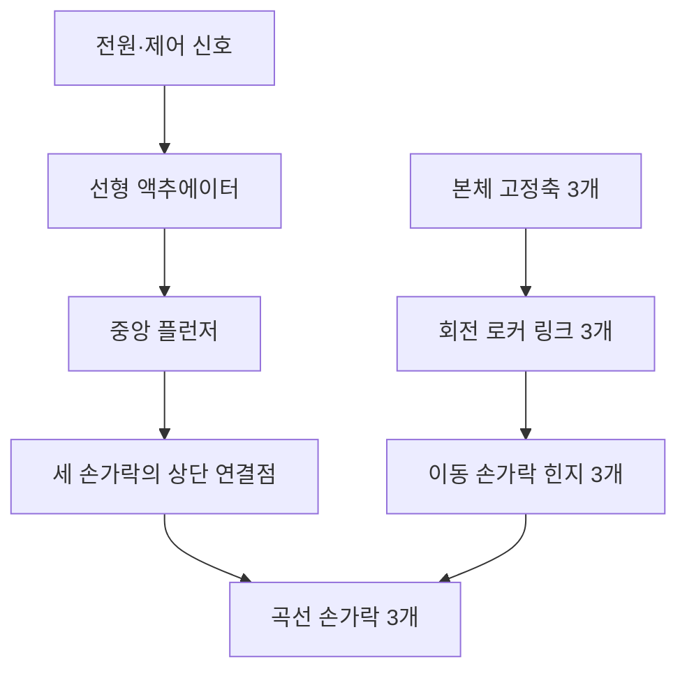
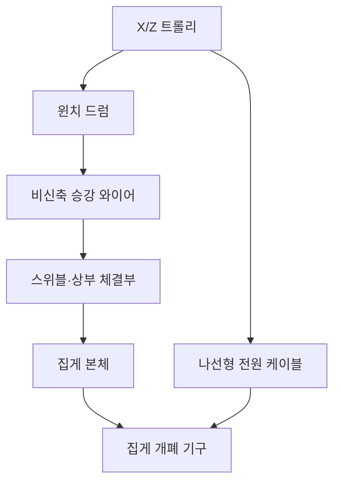

# 실제 인형뽑기 집게 메커니즘 분석 및 3D 구현 명세

## 1. 문서 목적

실제 인형뽑기 기계의 사진에서 확인되는 외부 구조와 동작 상태를 바탕으로,
집게의 기계적 구성과 3D·물리 구현 방향을 정의한다.

이 문서의 목표는 다음과 같다.

- 집게를 단순한 3개의 회전 막대가 아닌 실제 기구에 가까운 형태로 표현한다.
- 손가락, 중앙 액추에이터, 승강 와이어와 전원 케이블의 역할을 분리한다.
- 렌더링 메시와 물리 콜라이더를 분리해 외형과 시뮬레이션 안정성을 함께 확보한다.
- 사진에서 확인되는 사실과 내부 구조에 대한 추정을 구분한다.

## 2. 참고 이미지와 상태

| 구분 | 상태 | 주요 관찰 |
| --- | --- | --- |
| 참고 A | 집게가 올라가 있고 닫힌 상태 | 세 손가락 끝이 중앙으로 모이고 승강 와이어가 거의 노출되지 않음 |
| 참고 B | 집게가 올라가 있고 펼쳐진 상태 | 중앙 하부 슬라이더가 더 노출되고 세 손가락이 바깥쪽으로 회전함 |
| 참고 C | 집게가 내려간 상태 | 중앙의 붉은 와이어가 길게 노출되고 검은 나선 케이블이 별도로 따라 내려옴 |

참고 C를 통해 붉은 중앙선과 검은 나선선의 역할이 서로 다르다는 점을
확인할 수 있다.

- 붉은 중앙선: 집게 하중을 지지하는 승강 와이어
- 검은 나선선: 액추에이터에 전원과 신호를 공급하는 엄빌리컬 케이블
- 우측 투명선처럼 보이는 요소: 집게 부품으로 확정할 근거가 없어 구현에서 제외

## 3. 메커니즘 결론

집게는 중앙의 짧은 직선 운동 하나를 세 손가락의 회전 운동으로 변환하는
공통 구동 구조로 판단된다.



사진 비교상 중앙 하부 구조가 내려온 상태에서 손가락이 펼쳐져 있으므로
다음 관계일 가능성이 높다.

- 플런저 하강: 집게 펼침
- 플런저 상승: 집게 닫힘

원통형 하우징과 짧은 작동 스트로크를 고려하면 솔레노이드 기반 선형
플런저일 가능성이 높다. 다만 내부가 보이지 않으므로 모터와 캠 또는
리드스크루를 사용하는 구조일 가능성도 완전히 배제할 수 없다.

## 4. 손가락 관절 해석

각 손가락은 하나의 연속된 곡선 강체다. 손가락 중간이 꺾이는 2관절
손가락은 아니지만, 구동 기구에는 손가락마다 두 개의 회전축이 존재한다.

사진에서 손가락 위쪽에 보이는 긴 직선 플레이트는 다음 역할을 하는
회전 로커 링크 또는 `claw interconnect`로 해석한다.

- 상단 축을 중심으로 회전하며 고정된 링크 길이 유지
- 링크 하단의 손가락 힌지를 원호 궤도로 이동
- 손가락에 전달되는 굽힘 하중을 본체로 전달
- 플런저의 수직 운동을 손가락 회전으로 변환

따라서 손가락 한 개의 기본 구조는 다음과 같다.

1. 본체에 고정된 상단 회전축
2. 상단 축을 중심으로 회전하는 고정 길이 로커 링크
3. 링크 하단의 이동 손가락 힌지
4. 이동 힌지와 플런저 연결점을 잇는 곡선 손가락의 상단 구간
5. 플런저 연결점의 회전 핀

사진에서 손가락들이 겹쳐 보이는 것은 카메라 투영 때문이다. 실제로는
세 손가락이 원주 방향으로 약 120도씩 떨어진 서로 다른 방사 평면에 있다.

이 문서에서는 몸통과 손가락 힌지를 연결하는 직선 부품을 `로커 링크`로
통일해 부른다. 대화에서 사용한 `레버 암`은 같은 부품을 의미한다.

## 5. 전체 기계 계통

집게의 승강과 개폐는 서로 독립된 계통으로 구성해야 한다.



- 트롤리: 수평 위치와 수평 가속도를 결정한다.
- 윈치: 승강 와이어의 길이만 변경한다.
- 승강 와이어: 집게 하중을 지지하고 진자 운동을 허용한다.
- 스위블: 집게 본체의 수동 회전과 기울어짐을 허용한다.
- 나선형 케이블: 전원과 신호를 전달하며 주 하중을 지지하지 않는다.
- 중앙 액추에이터: 손가락의 개폐만 담당한다.

## 6. 필요한 실제 부품

### 6.1 트롤리 및 승강부

| 부품 | 역할 |
| --- | --- |
| X/Z 트롤리 프레임 | 집게의 수평 이동 |
| 구동 휠과 레일 | 트롤리의 각 축 이동 |
| 윈치 모터 | 승강 와이어 감기와 풀기 |
| 윈치 드럼 | 와이어 길이 제어 |
| 와이어 가이드 | 드럼에서 와이어가 일정하게 나오도록 안내 |
| 붉은 피복 승강 와이어 | 집게 하중 지지 |
| 상부 체결구 | 와이어와 집게 본체 연결 |
| 스위블 또는 회전 베어링 | 집게의 수동 Yaw 회전 허용 |
| 검은 나선형 전원 케이블 | 집게 액추에이터 전원·신호 공급 |
| 스트레인 릴리프 | 케이블 단선과 커넥터 하중 방지 |

### 6.2 집게 본체

| 부품 | 역할 |
| --- | --- |
| 상부 캡 | 와이어 및 케이블 연결부 보호 |
| 원통형 하우징 | 액추에이터와 플런저 수용 |
| 외장 칼라 | 하우징 표면에 밀착된 수평 밴드로 결합부와 단차 표현 |
| 선형 액추에이터 | 개폐에 필요한 직선 힘 생성 |
| 중앙 플런저 | 액추에이터 힘을 하부로 전달 |
| 가이드 부싱 | 플런저의 좌우 흔들림 억제 |
| 복귀 스프링 | 전원 해제 시 기본 상태로 복귀 |
| 공통 슬라이더·요크 | 하나의 플런저 운동을 세 손가락 연결점에 분배 |
| 하부 스파이더 | 세 상단 회전축을 120도 간격으로 고정 |

### 6.3 손가락 구동부

| 부품 | 역할 |
| --- | --- |
| 로커 링크 3개 | 손가락 힌지를 고정 반경의 원호로 안내 |
| 본체 피벗 핀 3개 | 로커 링크의 상단 회전축 |
| 이동 힌지 핀 3개 | 로커 링크와 곡선 손가락 결합 |
| 부싱·와셔·고정링 | 마찰과 축 방향 유격 관리 |
| 플런저 연결 핀 3개 | 플런저와 손가락 상단을 회전 결합 |
| 열림·닫힘 스토퍼 | 관절 한계와 손가락 관통 방지 |
| 곡선 손가락 3개 | 인형 접촉과 파지 |
| 끝단 마감 또는 패드 | 인형 손상 방지와 접촉 마찰 확보 |

### 6.4 외형 디테일

- 하우징 결합선과 단차
- 외장 칼라는 몸통을 관통하는 세로 고리가 아니라 Y축 두께가 얇은 수평 원통으로 표현
- 육각 볼트와 원형 핀 헤드
- 브래킷의 절곡선
- 링크 플레이트의 슬롯과 구멍
- 와셔와 스냅링
- 케이블 체결 너트
- 금속 표면의 미세한 스크래치와 반사 왜곡

## 7. 3D 객체 계층

```text
MachineFrame
└─ Trolley
   ├─ WinchDrum
   ├─ PowerUmbilical
   └─ HoistCable
      └─ SuspensionSwivel
         └─ ClawBody
            ├─ UpperCap
            ├─ ActuatorHousing
            ├─ PlungerVisual
            └─ FingerAssemblyVisual × 3
               ├─ FixedBracket
               ├─ RockerLink
               ├─ HingePin
               └─ CurvedFingerVisual

PhysicsScene
├─ ClawBodyRigidBody
├─ PlungerCollider
├─ RockerLinkCollider × 3
└─ CurvedFingerCollider × 3
```

집게 본체 전체를 트롤리의 자식으로 직접 고정하면 안 된다. 트롤리와 집게
사이에는 길이 제약을 가진 와이어가 존재해야 하며, 트롤리 가속과 정지에
의해 집게가 자연스럽게 흔들려야 한다.

위 계층에서 `PlungerVisual`, `RockerLink`, `CurvedFingerVisual`은 모두
`ClawBody`의 로컬 좌표를 사용한다. 플런저·로커·곡선 손가락 충돌체는 물리
월드에 별도 키네마틱 바디로 존재하며, 같은 기구학 자세를 월드 좌표로
변환해 따라간다.

## 8. 좌표와 관절 배치

Y축을 위쪽으로 정의하고 세 손가락의 원주 배치각을 다음과 같이 둔다.

```text
φ₀ = 0°
φ₁ = 120°
φ₂ = 240°
```

각 손가락은 중심에서 바깥쪽으로 향하는 방사형 수직 평면 안에서 움직인다.
손가락의 힌지 축은 해당 방사 방향과 수직인 접선 방향이어야 한다.

배치각이 `φ`인 손가락의 힌지 축은 개념적으로 다음과 같다.

```text
hingeAxis = (-sin φ, 0, cos φ)
```

세 손가락에 동일한 월드 축을 사용하면 모두 같은 방향으로 접히거나 서로
관통하게 된다.

## 9. 링크 기구학

중앙 플런저 위치를 하나의 공유 상태 `q`로 사용한다.

- `A`: 본체에 고정된 로커 링크 상단 피벗
- `B(q)`: 원호를 따라 움직이는 손가락 힌지
- `C(q)`: 수직 이동하는 플런저 연결점
- `l₁`: 로커 링크 `A-B`의 고정 길이
- `l₂`: 곡선 손가락 상단 `B-C`의 고정 길이
- `θ`: 손가락 회전각

두 강체 구간의 길이는 고정되어 있으므로 다음 조건을 동시에 만족해야 한다.

```text
|B(q) - A| = l₁
|C(q) - B(q)| = l₂
```

`B`는 `A` 중심 반지름 `l₁`인 원과 `C` 중심 반지름 `l₂`인 원의 바깥쪽
교점이다. 플런저가 상승하면 `B`가 본체 바깥쪽으로 이동하고, `B-C` 방향으로
손가락 각도 `θ`가 결정된다.

단순하게 다음과 같이 선형 보간하는 방식은 피한다.

```text
θ = lerp(openAngle, closeAngle, closeProgress)
```

선형 보간은 링크의 기계적 이득 변화와 끝단 부근의 속도 변화를 표현하지
못해 움직임이 애니메이션처럼 보이기 쉽다.

## 10. 권장 물리 구현

### 10.1 현재 하이브리드 링크 방식

현재 구성은 다음과 같다.

- 집게 본체: 동적 RigidBody
- 승강 와이어: 비신축 길이 제약
- 중앙 플런저: Y축 직선 변위를 유일한 구동 입력으로 사용하는 Kinematic RigidBody
- 로커 링크: 본체 피벗에 고정되어 접선축으로만 회전하는 자식 시각 그룹
- 손가락 외형: 공통 힌지 좌표를 사용하는 본체 자식 시각 그룹
- 로커 링크 충돌체: 계산된 피벗 회전을 따르는 Kinematic RigidBody 3개
- 손가락 충돌체: 외형과 같은 자세를 따르는 별도 Kinematic RigidBody
- 인형 접촉: 플런저·로커·곡선 손가락의 단순 복합 콜라이더가 처리

게임 상태는 개폐 진행률이나 손가락 각도를 직접 변경하지 않고 플런저의
로컬 Y 위치만 이동한다. `A-B`, `B-C` 고정 길이 조건의 두 원 교점을 풀어
로커 각도, 이동 힌지와 손가락 각도를 구한다. 계산된 로컬 자세는 렌더
메시와 모든 링크 충돌체에 동일하게 적용된다.

로커 링크의 상단 위치는 본체의 고정 피벗과 같은 로컬 좌표를 사용한다.
별도 월드 위치를 추종하지 않고 피벗의 접선축 회전각만 변경하므로, 동적
본체가 흔들리거나 이동해도 연결부에 한 프레임 지연이나 틈이 생기지 않는다.

Rapier 조인트로 세 개의 완전한 폐쇄 루프를 동시에 구성하지 않는다. 공유
플런저에 연결된 다중 폐쇄 루프는 작은 초기 오차나 접촉 충격만으로도
과구속 상태가 되어, 링크가 공중에서 정지하거나 본체만 이동하는 실패를
일으킬 수 있기 때문이다.

### 10.2 안정성 튜닝

하이브리드 링크는 다음 원칙으로 관리한다.

- 모든 링크 기준 길이를 동일한 기구학 계산값에서 생성
- 로커 링크 상단은 본체 자식 피벗에 고정하고 접선축 회전만 적용
- 플런저는 몸통 중심 로컬 Y축 이동만 허용
- 손가락 외형은 공통 힌지의 로컬 위치와 회전을 직접 사용
- 플런저·로커·손가락 충돌체에 몸통의 월드 변환을 합성
- 충돌체는 순간 이동하지 않고 다음 Kinematic 자세를 지정해 접촉 속도 생성
- 승강 와이어는 동적 본체 하나에만 연결해 링크가 와이어 운동을 방해하지 않음
- 렌더링 메시와 단순 복합 콜라이더가 같은 기구학 자세를 공유

### 10.3 현재 구현의 책임 분리

| 구성 요소 | 구현 방식 | 책임 |
| --- | --- | --- |
| 집게 본체 | Dynamic RigidBody | 중력, 와이어 장력, 수평 이동 관성, 흔들림 |
| 플런저 외형 | 본체 자식 시각 그룹 | 중심축을 유지하며 로컬 Y축으로만 이동 |
| 플런저 충돌체 | Kinematic RigidBody | 유일한 구동 입력과 축·요크 물리 형상 표시 |
| 로커 링크 외형 | 본체 자식 시각 그룹 | 고정 피벗 `A`에서 접선축으로만 회전 |
| 로커 링크 충돌체 | Kinematic RigidBody × 3 | 고정 길이 `A-B` 링크의 물리 형상 표시 |
| 손가락 외형 | 본체 자식 시각 그룹 | 공통 힌지 `B(q)`에서 계산된 각도로 회전 |
| 손가락 충돌체 | Kinematic RigidBody × 3 | 곡선 날과 `B-C` 레버의 마찰·접촉·밀어내기 |
| 승강 와이어 | Rope Joint | 비신축 최대 길이와 진자 운동 |
| 전원 케이블 | 시각 전용 곡선 | 느슨한 나선형 엄빌리컬 표현 |

`getClawPoseFromPlungerY(q)`가 플런저 위치를 입력받아 로커 각도, 손가락
힌지와 손가락 각도를 결정하는 단일 기준이다. 렌더링 메시와 충돌체가 각자
위치를 추정해서는 안 된다.

### 10.4 구현 변경 이력과 이유

| 단계 | 방식 | 확인된 문제 | 결정 |
| --- | --- | --- | --- |
| 1 | 플런저·로커·손가락을 모두 동적 바디와 폐쇄형 조인트로 연결 | 다중 폐쇄 루프가 과구속되어 하강 정지, 공중 고정, 본체 분리 발생 | 폐기 |
| 2 | 각 부품을 별도 키네마틱 바디로 만들어 본체 월드 자세 추종 | 물리 스텝 순서 때문에 한 프레임 지연과 연결부 이격 발생 | 폐기 |
| 3 | 로커 링크만 몸통 자식으로 고정 | 몸통–로커 피벗은 안정됐지만 플런저–몸통과 로커–손가락에 미세 이격 잔존 | 과도 단계 |
| 4 | 보이는 플런저·로커·손가락을 모두 몸통 로컬 계층으로 통합 | 명목상 연결점이 동일 프레임에서 일치하지만 디버그 화면에서 링크 물리 형상이 누락 | 이전 방식 |
| 5 | 플런저 Y 변위를 단일 입력으로 사용하고 플런저·로커·손가락 복합 충돌체에 동일한 해석 자세 적용 | 폐쇄 루프 과구속 없이 전체 링크 형상을 확인 가능 | 현재 방식 |

집게 관련 링크 바디는 본체 1개, 플런저 1개, 로커 3개와 손가락 3개로
구성한다. 링크 바디는 폐쇄형 Rapier 조인트로 서로 힘을 전달하지 않고,
플런저 변위에서 해석한 다음 Kinematic 자세를 공유한다.

현재 방식은 다음 시나리오에서 검증했다.

1. 올라간 열린 상태에서 플런저와 세 연결부 정렬
2. 열린 상태 하강과 와이어 길이 증가
3. 플런저 상승에 따른 세 손가락 닫힘
4. 인형 접촉과 들어 올림
5. 상승 후 배출구 이동
6. 전 과정에서 공중에 남는 링크나 본체 분리 없음

### 10.5 의도적 유격 추가 원칙

유격은 명목상 연결점이 완전히 일치한 현재 구조 위에만 추가한다. 프레임
지연이나 좌표 불일치를 유격처럼 남겨두지 않는다.

- 몸통–로커 상단 피벗: 접선축 기준 약 `±1~2°`의 제한된 회전 백래시
- 핀과 구멍 사이: 실제 치수 확인 전에는 시각적으로 `1~3mm` 이내의 이동
- 플런저: 중심축 이탈 없이 가이드 부싱 안에서 미세한 회전 또는 충격만 허용
- 흔들림 발생 조건: 트롤리 가감속, 스토퍼 접촉, 인형 충돌
- 복귀 방식: 감쇠된 짧은 진동 후 명목 자세로 복귀
- 금지 사항: 입력과 무관하게 계속 반복되는 사인파 진동

유격 상태는 렌더링 오프셋으로 먼저 검증하고, 파지 결과에 영향을 줄 필요가
확인된 경우에만 충돌체 자세에도 제한적으로 반영한다.

## 11. 승강 와이어와 흔들림

승강 와이어는 신축성 있는 스프링이 아니다.

- 와이어 길이는 윈치 속도에 따라 직접 증가하거나 감소한다.
- 장력 방향의 거리 오차는 즉시 투영해 제거한다.
- 접선 방향 속도는 보존해 진자 운동을 유지한다.
- 트롤리 이동 시 집게 위치를 직접 복사하지 않는다.
- 트롤리 가속과 감속이 집게 흔들림의 원인이 되어야 한다.

올라간 상태에서는 윈치 출구와 집게 상부 캡 사이의 최소 길이를 작게 하여
붉은 와이어가 거의 보이지 않도록 한다. 내려간 상태에서는 참고 C처럼
와이어가 중앙에서 곧게 장력을 받는 모습이 보여야 한다.

검은 나선 케이블은 승강 와이어와 별도의 곡선으로 표현한다.

- 집게를 지탱하지 않음
- 내려갈 때 코일 간격 또는 전체 곡선 길이가 증가
- 집게 주변에서 느슨한 곡률 유지
- 물리 충돌은 생략하거나 매우 단순화
- 필요하면 집게 회전에 약한 감쇠만 추가

## 12. 곡선 손가락 메시

손가락은 원형 파이프가 아니라 납작한 금속 스트립에 가까운 단면으로
제작한다.

권장 형상은 다음과 같다.

1. 힌지 직후에는 거의 수직으로 내려온다.
2. 중간 구간에서 바깥쪽으로 완만하게 부푼다.
3. 하단에서 중심 방향으로 큰 곡률을 가진다.
4. 끝부분은 짧고 둥글게 마감한다.

Blender에서는 Bezier Curve와 직사각형 Bevel Object를 사용하는 것이
적합하다. 코드에서 생성할 경우 2D 곡선을 따라 둥근 직사각형 단면을
스윕하는 방식이 좋다.

일반적인 원형 `TubeGeometry`만 사용하면 사진의 절곡 금속 느낌이 약해진다.

## 13. 렌더링 메시와 충돌체

렌더링 메시와 물리 충돌체는 분리한다.

### 렌더링 메시

- 매끄러운 연속 곡선
- 실제 두께와 폭
- 모서리 Bevel
- 핀 구멍과 체결부
- 금속 표면 디테일

### 물리 충돌체

- 집게 하우징은 전체 외곽을 감싸는 단일 원통으로 단순화
- 곡선을 따라 배치한 8~12개의 캡슐 또는 둥근 직육면체
- 힌지 근처의 짧은 별도 충돌체
- 끝부분의 둥근 접촉 충돌체
- 플런저 축·요크와 세 로커 링크의 별도 단순 충돌체
- 인접 충돌체는 작은 간격 없이 일부 겹쳐 연속 접촉면 구성

손가락 전체를 하나의 직선 캡슐로 처리하면 곡선 안쪽의 파지 공간을 제대로
사용할 수 없고 인형을 실제보다 일찍 밀어낸다.

## 14. 손가락 관통 방지

손가락 겹침은 충돌체만으로 해결하지 않고 기구학적 제한을 우선한다.

- 세 손가락을 정확히 120도 간격으로 배치
- 실제 메시 두께 반영
- 힌지 위치에 충분한 원주 반경 확보
- 열림·닫힘 각도에 하드 리밋 적용
- 완전히 닫혀도 세 끝단 사이에 최소 간격 유지
- 링크와 손가락 레버에도 기계적 스토퍼 적용
- 손가락 간 충돌은 최종 안전장치로만 사용

카메라 화면에서 교차해 보이는 것은 가능하지만 3D 공간에서 메시나
콜라이더가 서로 관통해서는 안 된다.

## 15. 실제 같은 동작을 만드는 요소

외형만큼 다음 동작 특성이 중요하다.

- 솔레노이드 작동 시 짧고 빠른 초기 충격
- 링크 기구에 의한 비선형 개폐 속도
- 복귀 스프링에 의한 빠른 열림
- 최대 열림 스토퍼 접촉 후 작은 반동
- 개폐 시 본체에 전달되는 약한 반작용
- 솔레노이드 클릭음, 핀 충돌음과 윈치 모터음

현재는 세 손가락 외형이 하나의 플런저 상태를 공유하며 기구학적으로 같은
진행률을 사용한다. 각 손가락의 접촉과 마찰은 별도 충돌체로 계산하지만,
접촉 때문에 개별 손가락이 목표 각도에 도달하지 못하는 힘 제한 모델은 아직
구현하지 않았다.

다음 항목은 명목상 결합과 승강 안정성이 검증된 뒤 추가한다.

- 공통 액추에이터 최대 힘과 유지 전류
- 인형 접촉 시 손가락별 실제 각도 편차
- 힌지와 링크 핀의 제한된 유격
- 손가락별 미세한 정렬 편차
- 스토퍼 접촉 충격과 감쇠

인형을 집게 중심으로 끌어당기는 숨은 힘은 사용하지 않는다.

## 16. 재질과 시각적 표현

### 크롬 하우징

- 높은 Metalness
- 너무 낮지 않은 Roughness
- 실내 환경맵 반사
- 수평 칼라와 단차에 약한 스크래치
- 완벽한 거울보다 약간 흐린 반사

### 손가락

- 스테인리스 또는 도금 강판
- 하우징보다 조금 거친 표면
- 단면 두께가 보이도록 처리
- 끝부분의 마모와 미세한 색 변화

### 브래킷과 링크

- 절곡된 판금 형상
- 핀 주변의 원형 와셔
- 볼트 헤드와 고정링
- 링크 구멍 내부의 음영

### 케이블

- 붉은 와이어는 가늘지만 장력 방향이 명확하게 보이도록 표현
- 검은 나선 케이블은 무광 고무 재질

## 17. 게임 동작 시퀀스

권장 상태 순서는 다음과 같다.

1. 대기: 집게가 올라가 있고 펼쳐져 있음
2. 위치 조작: 트롤리가 이동하며 집게가 관성으로 흔들림
3. 하강: 와이어 길이가 증가하고 집게가 열린 상태로 내려감
4. 착지·안정: 짧은 시간 동안 흔들림과 접촉이 정리됨
5. 파지: 플런저가 상승하고 계산된 링크 자세에 따라 손가락이 닫힘
6. 상승: 닫힘 유지 전류와 함께 와이어 길이가 감소
7. 이동 또는 판정: 집게와 인형의 실제 접촉 상태 유지
8. 해제: 액추에이터가 풀리고 복귀 스프링으로 집게가 열림

파지 단계와 상승 단계를 분리해야 인형에 닿자마자 집게가 순간 이동하는
느낌을 피할 수 있다.

## 18. 디버그 계측 항목

현재 계측 항목:

- 현재 승강 와이어 길이
- 와이어 거리 오차
- 집게 본체 흔들림 각도
- 물리 프레임 시간과 활성 바디 수
- 손가락 끝단 사이 최소 거리

후속 물리 모델에서 추가할 항목:

- 와이어 목표 길이
- 플런저 위치 `q`
- 각 손가락의 목표 각도와 실제 각도
- 각 손가락 모터 토크
- 손가락별 접촉 개수
- 로커 링크와 손가락 상단 길이 오차
- 본체 Yaw 회전 속도

## 19. 완료 기준

### 외형

- 손가락이 하나의 연속된 곡선 부품으로 보인다.
- 고정 피벗, 회전 로커 링크, 이동 힌지와 플런저가 구분된다.
- 세 손가락이 120도 간격으로 배치된다.
- 열린 상태와 닫힌 상태 모두 메시가 관통하지 않는다.
- 올라간 상태에서는 붉은 승강 와이어가 거의 보이지 않는다.
- 내려간 상태에서는 붉은 와이어와 검은 나선 케이블이 명확히 구분된다.

### 동작

- 누르는 애니메이션이 아니라 중앙 플런저 상태를 기준으로 집게가 움직인다.
- 플런저 상승 시 이동 힌지가 바깥쪽 원호로 움직이며 손가락이 닫힌다.
- 플런저는 몸통 중심축을 벗어나지 않고 Y축으로만 이동한다.
- 로커 링크 끝과 손가락 힌지가 개폐 전 과정에서 분리되지 않는다.
- 대각선 또는 수평 트롤리 이동 후 집게가 진자 운동한다.
- 와이어 길이 변화에 스프링성 신축 진동이 발생하지 않는다.
- 손가락이나 인형에 숨은 흡착·당김 힘이 없다.

### 안정성

- 최대 열림과 닫힘에서 손가락 관통이 없다.
- 링크 계산이 프레임 속도에 따라 달라지지 않는다.
- 물리 서브스텝에서도 집게가 폭발하거나 떨리지 않는다.
- 집게가 인형 더미에 끼여도 시뮬레이션이 유지된다.
- 하강·상승·배출구 이동 후 공중에 남는 시각 부품이 없다.

후속 힘 제한 모델의 완료 기준:

- 인형 접촉 시 손가락이 목표 각도에 도달하지 못할 수 있다.
- 세 손가락이 공통 액추에이터 힘 한계를 공유한다.
- 유격은 정해진 범위 안에서만 발생하고 감쇠 후 명목 자세로 복귀한다.

## 20. 불확실한 부분

사진만으로 다음 항목은 확정할 수 없다.

- 액추에이터가 솔레노이드인지 모터식 캠인지
- 플런저의 정확한 이동 거리
- 중앙 플런저와 손가락 상단의 정확한 체결 방식
- 복귀 스프링의 위치와 강성
- 플런저 연결 핀의 슬롯 또는 유격 구조
- 실제 손가락 치수와 질량
- 손가락 끝단에 별도의 마찰 코팅이 있는지

정확도를 높이려면 다음 자료가 추가로 필요하다.

- 집게가 열리고 닫히는 과정의 측면 슬로모션 영상
- 집게 하부를 올려다본 사진
- 하우징 하단과 손가락 루트의 근접 사진
- 하우징 직경, 손가락 길이와 최대 개방 폭
- 플런저 노출 길이의 열린 상태·닫힌 상태 비교값

## 21. 권장 구현 순서

1. 사진 비율을 기준으로 본체, 로커 링크와 손가락의 기준 치수 설정
2. 단일 곡선 손가락의 렌더링 메시와 복합 콜라이더 제작
3. 세 상단 피벗과 로커 링크를 120도 간격으로 배치
4. 플런저 공유 상태와 두 원 교점 기구학 구현
5. 보이는 플런저·로커·손가락을 몸통 로컬 계층으로 통합
6. 기구학 자세를 따르는 손가락 복합 콜라이더와 인형 접촉 연결
7. 비신축 승강 와이어와 스위블 흔들림 적용
8. 검은 나선 케이블 시각화
9. 하강·상승·배출구 이동에서 결합 상태 검증
10. 제한된 회전 백래시와 핀 유격 추가
11. 공통 액추에이터 힘 제한과 손가락별 접촉 편차 구현
12. 크롬 재질, 볼트, 핀, 단차와 음향 추가
13. 참고 이미지의 세 상태를 동일 카메라 구도로 비교 검증

현재는 1~9단계의 하이브리드 구조까지 구현했다. 완전한 폐쇄형 물리
링크는 안정성 비용이 크므로 기본 목표로 되돌리지 않는다. 실제 파지 결과에
필요한 유격과 힘 제한만 현재 기구학 구조 위에 제한적으로 추가한다.
